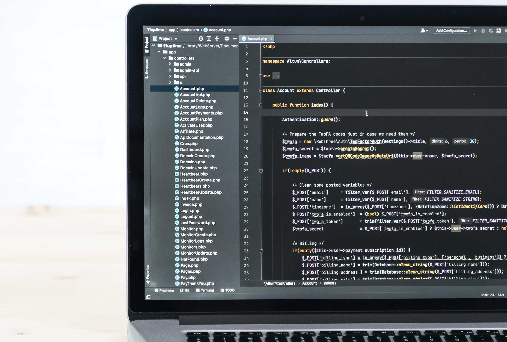

# Curso de PHP Orientado a objetos - código 58451

> Curso de PHP Object Oriented Programming |
> Lunes y Miércoles 17hs a 19hs (Arg) |
> Código: 58451 |  
> Instructor: Marcos Pinardi |

## Paradigmas de programación

> Un paradigma de programación es una manera o estilo de programación de software. Existen diferentes formas de diseñar un lenguaje de programación y varios modos de trabajar para obtener los resultados que necesitan los programadores.  Se trata de un conjunto de métodos sistemáticos aplicables en todos los niveles del diseño de programas para resolver problemas computacionales.

### Imperativo:
>Los programas se componen de un conjunto de sentencias que
cambian su estado. Son secuencias de comandos que ordenan acciones a la
computadora.

### Declarativo:
> Opuesto al imperativo. Los programas describen los resultados
esperados sin mostrar explícitamente los pasos a llevar a cabo para
alcanzarlos.

### Lógico:
>El problema se modela con enunciados de lógica de primer orden.

### Funcional:
>Los programas se componen de funciones, es decir, implementaciones de comportamiento que reciben un conjunto de datos de
entrada y devuelven un valor de salida.

### Programación orientada a objetos
>En este modelo de paradigma se construyen modelos de objetos que representan elementos (objetos) del problema a resolver, que tienen características y funciones. Permite separar los diferentes componentes de un programa, simplificando así su creación, depuración y posteriores mejoras. La programación orientada a objetos disminuye los errores y promociona la reutilización del código. Es una manera especial de programar, que se acerca de alguna manera a cómo expresaríamos las cosas en la vida real.

## Diferenciación: OOP vs Procedural

> Cuando programamos, procedural, programamos funciones.
> Y en esta modo de programar tenemos separados los datos de los procedimientos.

> En cambio cuando programamos orientado a objetos,
> estos estan íntimamente relacionados en lo que conocemos como **estado**.

### Programación reactiva
>Este paradigma se basa en escuchar lo que emite un evento o cambios en el flujo de datos, en donde los objetos reaccionan a los valores que reciben de dicho cambio.

#### Extenisones recomendadas para VSC

    https://marketplace.visualstudio.com/items?itemName=phproberto.vscode-php-getters-setters
    
    https://marketplace.visualstudio.com/items?itemName=bmewburn.vscode-intelephense-client
    